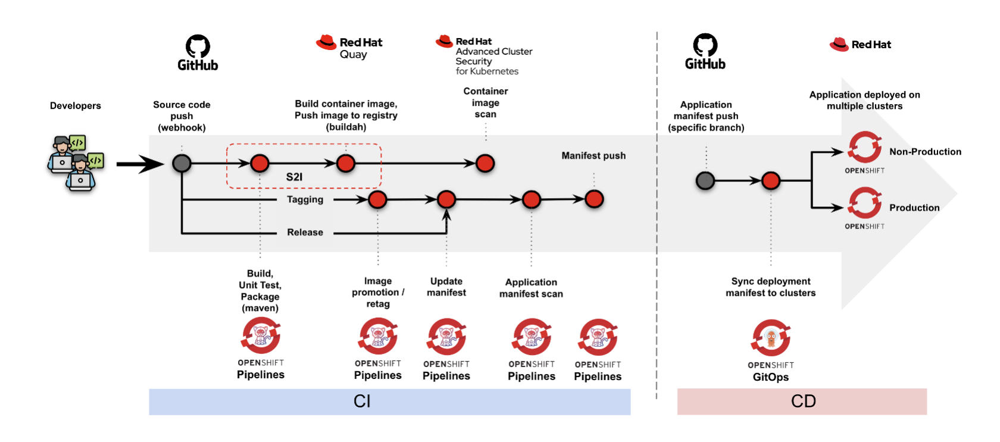

# TODO Application GitOps

## Overall architecture




## Prerequisites

- All projects are stored in GitHub repository
- Openshift Pipeline operator is installed
- Openshift GitOps operator is installed
- ACS operator is installed and configured
- Quay operator is installed
- Sealed Secret operator (Bitnami) is installed
- Required namespaces:
  - For pipeline and deployment to Dev:
    - todo-dev
  - For deployment to SIT and Prod:
    - todo-sit
    - todo-prod


## Notes for the implementation

### Check role for openshift-gitops namespace

```
$ oc patch cm/argocd-rbac-cm -n openshift-gitops --type=merge -p '{"data": { "policy.default": "role:admin" } }'
```

### Command to generate sealed secrets from secrets YAML

```
$ kubeseal --format yaml < [source-secrets.yaml] > [target-sealed-secrets].yaml
```
